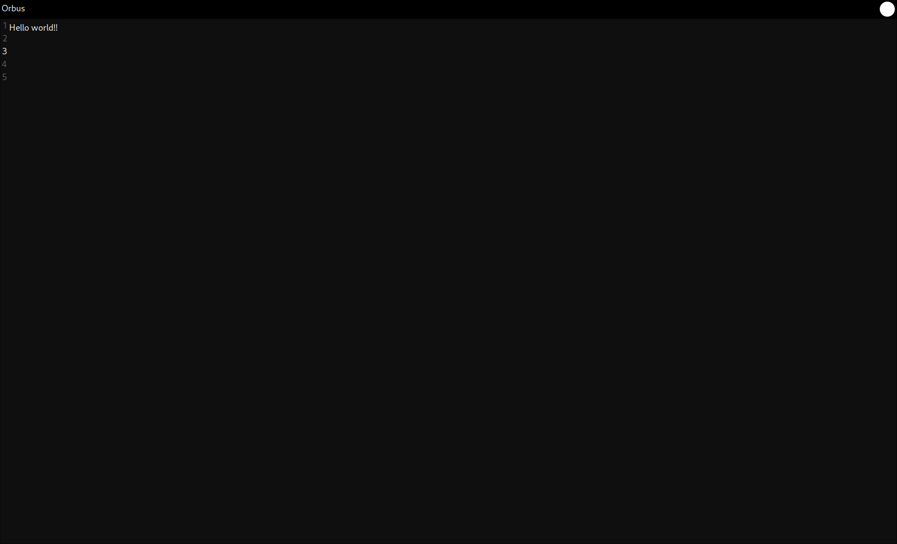

# Orbus text editor

Orbus is a text editor written in Go & TS. It is a work in progress.

This project is a learning project to learn more about Go, TS and LSP.

## Preview



## Features

* [x] A space to write
* [x] A numbers column
* [ ] Create a file
* [ ] Save a file
* [ ] Open a file
* [ ] Edit a file
* [ ] Search in a file
* [ ] Replace in a file
* [ ] Shortcuts
* [ ] Syntax highlighting with LSP
* [ ] Autocompletion with LSP
* [ ] Config file where you can set your preferences and the LSP configs.
* [ ] Multiple tabs
* [ ] Theme support
* [ ] Account
* [ ] Plugins

## How to run

```bash
wails dev
```

## How to build

```bash
wails build
```

### Thanks ChatGPT
